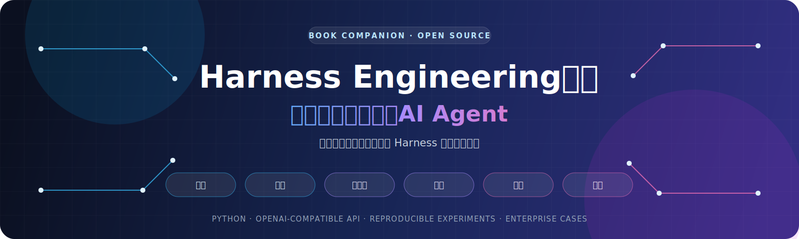
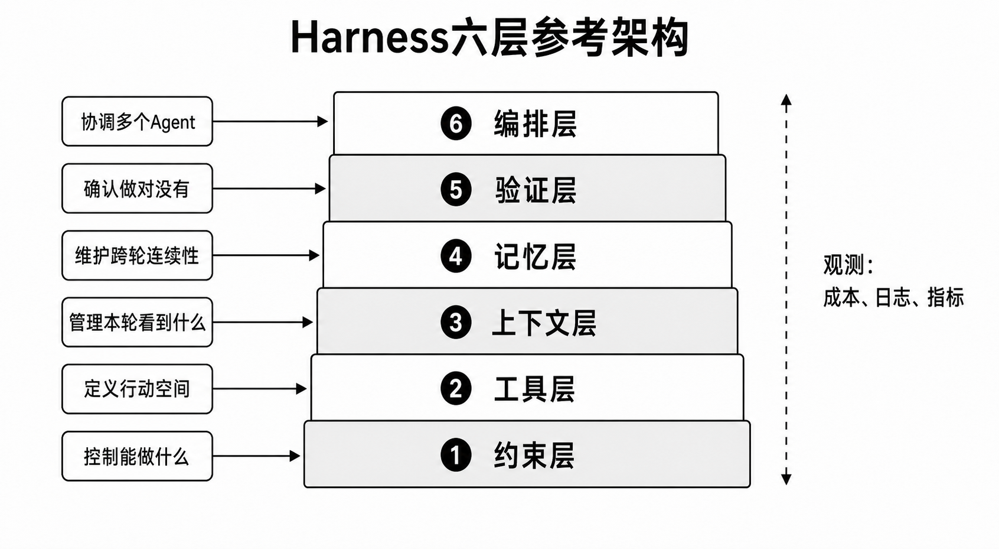

<p align="center">
  
</p>

<p align="center">
  <a href="https://www.python.org/downloads/"></a>
  <a href="#运行测试"></a>
  <a href="docs/CHAPTER_INDEX.md"></a>
  <a href="LICENSE"></a>
</p>

<p align="center">
  <strong>不是再造一个模型，而是构建模型之外的可靠性系统。</strong><br />
  从教学框架到生产内核，用可运行代码讲透约束、工具、上下文、记忆、验证与多 Agent 编排。
</p>

<p align="center">
  <a href="#快速开始">快速开始</a> ·
  <a href="#六层架构">六层架构</a> ·
  <a href="#选择阅读路径">阅读路径</a> ·
  <a href="#企业级实战">实战案例</a> ·
  <a href="docs/CHAPTER_INDEX.md">章节索引</a> ·
  <a href="docs/TROUBLESHOOTING.md">排错指南</a>
</p>

---

## 这个仓库解决什么问题

AI 模型越来越强，但生产级 Agent 的可靠性不会自动随之提升：多轮任务会丢失目标，上下文会腐化，工具调用会越界，错误会重复发生，多个 Agent 也可能彼此制造混乱。

**Harness Engineering** 关注模型之外的工程系统：通过约束行动空间、设计工具契约、管理上下文与记忆、建立可执行验证、编排角色协作，让 Agent 从“偶尔能跑”变成“可解释、可验收、可恢复”。

| 从零构建 | 可复现实验 | 企业级实战 |
|:---:|:---:|:---:|
| `harness_py/` 教学层逐步实现核心机制 | `experiments/` 提供章节对照实验与结果 | Java 重构、医疗合规、跨语言多 Agent |
| 代码短、依赖轻，适合边读边调试 | 不只讲结论，还保留验证入口 | 面向真实工程边界，而非玩具 Demo |

| 双层实现 | 六层架构 | 章节覆盖 | 实战案例 | 自动化测试 |
|:---:|:---:|:---:|:---:|:---:|
| 教学层 + 生产层 | 约束 → 编排 | 第 1—12 章 | 3 个 | 226 项 |

## 快速开始

### 1. 克隆并创建环境

```powershell
git clone https://github.com/Luxuzhou/harness-py-book.git
cd harness-py-book

python -m venv .venv
.\.venv\Scripts\Activate.ps1
python -m pip install -r requirements.txt
```

<details>
<summary>macOS / Linux</summary>

```bash
git clone https://github.com/Luxuzhou/harness-py-book.git
cd harness-py-book

python -m venv .venv
source .venv/bin/activate
python -m pip install -r requirements.txt
```

</details>

### 2. 运行第一组验证

```powershell
python -B -m pytest tests -q -p no:cacheprovider
# 89 passed

python -B examples\ch03_safety_demo.py
```

这组命令不需要 API Key。若要运行第 10 章服务测试，再安装案例依赖：

```powershell
python -m pip install -r cases\data_compliance\target_service\requirements.txt
python -B -m pytest cases\data_compliance\target_service\tests -q -p no:cacheprovider
# 137 passed
```

### 3. 配置模型 API（可选）

第 9—11 章实战需要 OpenAI 兼容接口。复制 `.env.example` 为 `.env`，再填写自己的配置：

```text
OPENAI_BASE_URL=https://api.deepseek.com/v1
OPENAI_API_KEY=your-api-key
OPENAI_MODEL=deepseek-chat
```

> [!IMPORTANT]
> `.env` 已被 Git 忽略。不要把 API Key、Session 日志或真实业务数据提交到公开仓库。

## 六层架构

<p align="center">
  
</p>

| 层 | 核心问题 | 代表模块 | 关键能力 |
|:---:|---|---|---|
| ① 约束层 | Agent 能做什么？ | `config.py` `sandbox.py` | 权限控制、路径隔离、预算熔断 |
| ② 工具层 | Agent 如何行动？ | `tools.py` `mcp_client.py` | 工具契约、Schema、MCP、路径安全 |
| ③ 上下文层 | 本轮应该看到什么？ | `prompt.py` | 项目规则、上下文装配、Prompt Cache |
| ④ 记忆层 | 如何保持跨轮连续性？ | `memory.py` `session.py` `compact.py` | 压缩、长期记忆、断点恢复 |
| ⑤ 验证层 | 如何证明任务完成？ | `loop_guard.py` `plan_tools.py` | 闭环验证、循环防护、对抗评估 |
| ⑥ 编排层 | 多个 Agent 如何协作？ | `swarm.py` `subagent_manager.py` | 角色隔离、并行分组、收敛控制 |

## 选择阅读路径

| 你的目标 | 建议入口 | 推荐顺序 |
|---|---|---|
| 第一次理解 Harness | `harness_py/` + `examples/` | 第 3 → 8 章最小示例 |
| 复现书中实验 | `experiments/` | 先读目录 README，再运行单个实验 |
| 查看生产级实现 | `harness_py_pro/` | `engine.py` → `tools.py` → `sandbox.py` → `swarm.py` |
| 体验企业任务 | `cases/` | 第 9 章 → 第 10 章 → 第 11 章 |
| 快速定位章节代码 | [章节与代码索引](docs/CHAPTER_INDEX.md) | 按章节查模块、命令和验收入口 |
| 运行失败后排查 | [常见问题与排错](docs/TROUBLESHOOTING.md) | 环境 → 依赖 → API → Git 基线 |

> [!WARNING]
> 第 9—11 章的 `run.py` 会让 Agent 修改 `cases/` 中的目标代码。复现实战前请确认 Git 工作区干净，或在单独分支、工作树或目录副本中运行。

## 企业级实战

| 第 9 章 · Java 遗留系统重构 | 第 10 章 · 医疗数据合规 | 第 11 章 · 多 Agent 集成 |
|---|---|---|
| Spring Boot 临床路径系统 | FastAPI 临床数据服务 | Architect / Java / Python / QA 四角色 |
| God Service、职责拆分、契约保持 | SQL 参数化、PII 脱敏、审计与沙箱 | 跨语言契约、并行分组、独立验收 |
| `cases/refactor_enterprise/` | `cases/data_compliance/` | `cases/multiagent_enterprise/` |
| `run.py` 执行，`verify.py` 验收 | 137 项服务测试 | 复用前两个案例的真实代码 |

这些案例刻意保留待 Agent 识别和修复的问题。下载仓库时看到的是**实验基线**，不是可以直接部署到生产环境的完成态业务系统。

## 仓库地图

```text
harness-py-book/
├── harness_py/          教学层：用最小实现讲清核心机制
├── harness_py_pro/      生产层：沙箱、Hook、Skill、观测与多 Agent
├── examples/            第 3—8 章与第 12 章最小示例
├── experiments/         可复现的章节实验与对照数据
├── cases/               第 9—11 章三个企业级实战
├── tests/               教学层与生产层根测试
├── figures/             书中配图
└── docs/                章节索引、环境准备与排错文档
```

<details>
<summary><strong>查看第 1—12 章运行入口</strong></summary>

| 章节 | 主题 | 最小入口 | 需要 API |
|---|---|---|:---:|
| 第 1 章 | Agent 的困境 | 阅读案例与图表 | 否 |
| 第 2 章 | Harness Engineering 方法论 | 阅读架构总览 | 否 |
| 第 3 章 | 约束层 | `python -B examples/ch03_safety_demo.py` | 否 |
| 第 4 章 | 工具层与 MCP | `python -B examples/ch04_tools.py` | 否 |
| 第 5 章 | 上下文工程 | `python -B examples/ch05_context.py` | 否 |
| 第 6 章 | 记忆与压缩 | `python -B examples/ch06_memory.py` | 否 |
| 第 7 章 | 验证与评估 | `python -B examples/ch07_verify.py` | 否 |
| 第 8 章 | 反馈调节 | `python -B examples/ch08_feedback.py` | 否 |
| 第 9 章 | Java 重构 | `python -B cases/refactor_enterprise/run.py` | 是 |
| 第 10 章 | 数据合规 | `python -B cases/data_compliance/run.py` | 是 |
| 第 11 章 | 多 Agent | `python -B cases/multiagent_enterprise/run.py` | 是 |
| 第 12 章 | 观测与部署 | `python -B examples/ch12_observe.py` | 否 |

</details>

## 运行测试

```powershell
# 框架测试：89 项，不需要 API Key
python -B -m pytest tests -q -p no:cacheprovider

# 第 10 章服务测试：137 项
python -B -m pytest cases\data_compliance\target_service\tests -q -p no:cacheprovider
```

涉及第 9 章 Java 项目时，还可以运行：

```powershell
cd cases\refactor_enterprise\target_project
mvn -DskipTests compile
```

## 文档

| 文档 | 用途 |
|---|---|
| [章节与代码索引](docs/CHAPTER_INDEX.md) | 第 1—12 章与模块、实验、验收入口映射 |
| [环境准备与实验命令](docs/ENVIRONMENT.md) | Python、Java、Maven、API 与完整复现顺序 |
| [常见问题与排错](docs/TROUBLESHOOTING.md) | 依赖、编码、测试、Git 基线与多 Agent 排错 |
| [代码架构](CODE_ARCHITECTURE.md) | 面向维护者的模块关系与实现说明 |
| [贡献指南](CONTRIBUTING.md) | Issue 与代码提交规范 |
| [安全说明](SECURITY.md) | 教学性缺陷、凭据和敏感数据边界 |

## 技术边界

- Python 3.10+，模型调用采用 OpenAI 兼容协议。
- 支持 DeepSeek、通义千问、Kimi、GLM 等兼容服务，具体配置见 `.env.example`。
- 教学层保持轻依赖，不要求 LangChain、LlamaIndex 或 AutoGen。
- 医疗案例使用合成数据，但日志、导出和凭据仍应按真实敏感数据标准保护。

## 作者与许可证

陆徐洲（Lex），LIMS 领域 AI 算法负责人，医疗信息化背景，控制工程研究生。

仓库代码以 [MIT License](LICENSE) 开源。书稿正文及出版内容版权归作者和电子工业出版社所有。欢迎通过 [Issues](https://github.com/Luxuzhou/harness-py-book/issues) 反馈问题；提交修改前请阅读 [CONTRIBUTING.md](CONTRIBUTING.md)，安全问题请参照 [SECURITY.md](SECURITY.md)。
